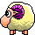

# Desktop Pet

Do you remember eSheep, the lovely desktop sheep?
 
If you had a lot of them on your old Windows desktop... welcome! 
This project makes it possible to bring a pet back to your desktop.  
 
You can change the pet and animations by editing an XML file (animations.xml). 
<h1>Application</h1>
This application is not a game, not a utility and not useful :P it simply shows you
a pet on the screen. This pet can walk, run, etc. and fall down onto windows on your desktop
or the taskbar (on your primary screen). 
<h1>Download</h1>
You can download a compiled Windows EXE from this page:
<a href='http://esheep.petrucci.ch'>http://esheep.petrucci.ch</a> 
The entire code documentation can be found online here:
<a href='http://adrianotiger.github.io/desktopPet/'>http://adrianotiger.github.io/desktopPet/</a>
<h1>Credits</h1>
This project uses other open source projects:
<ul>
<li><a href='https://naudio.codeplex.com'>NAudio</a> to play sounds
<li><a href='https://github.com/jamesqo/Stall'>Stall</a> to install the application and create an uninstaller 
</ul>
<h1>Thanks</h1>
<a href='https://github.com/Grunwaldt'>Sergi</a> for the tray icon 
<a href='https://github.com/rluiten'>Robin</a> improving the code and implementing the <a href='https://github.com/Adrianotiger/desktopPet/issues/6'>Graphviz tool</a>
<h1>Want to create your own mate/pet?</h1>
The easiest and fastest way is to use the <a href='http://esheep.petrucci.ch/?pagina=editor'>online editor</a>. 
But you can also download the original <a href='Resources/animations.xml'>animations.xml</a> and create your own desktop mate/pet. 
You will need:
<ul>
<li>1 application icon (.ico file)
<li>1 animation image: an image with transparency with all possible positions. (.png but not too big... something like 1000x500px)
</ul> 
For more information about editing the XML file and adding your own pet, follow the <a href='../../wiki/'>Wiki</a> page.  You can also download the manual to develop your pet online: <a href='https://github.com/Adrianotiger/desktopPet/raw/master/Manual/Manual%20-%20online%20editor.docx'>Manual-online editor.docx</a>
