# Desktop Pet (eSheep)

Can you remember eSheep, the lovely desktop sheep? 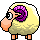  
**If you had a lot of them on the desktop... welcome to this page!**  

This project gives you the possibility to add a pet to your desktop.  
 

With a simple XML file (animations.xml) it is possible to change pet and animations.

# Application
This application is not a game, not a utility, and definitely not useful 😄. 
Its only purpose is to keep a little pet on your screen. 
The pet can fall down to the taskbar and detect windows on your desktop, allowing it to walk, run, and explore your workspace naturally, even across multiple monitors.

# Downloads

## Windows (Portable)
Compiled with .NET4.7, this application is just an exe and works on every 64-bit Windows. You can download it directly from the releases and once executed, you can choose if install the application locally (for autostart) or just leave the exe where you want.  

**This EXE is compiled from the main project and is always the most recent**  

| OS |  Windows 7/8/9/10/11 |
|---|---|
| Version |  1.5.0 | 
| Last update | october 2026 | 
| Link | <a href='https://github.com/Adrianotiger/desktopPet/releases/latest'> &nbsp; Download Page</a> |

## Windows 10 (Store)
Version 1.5.0 (store version: 2.6.**150**) is a new version and removed all UA and UWP parts from the older version (as Microsoft allows native .NET applications in the store). The store project has just the installer project to create a MSIX package. You can build and install it locally now.

| OS |  Windows 10/11 |
|---|---|
| Version |  2.6.150 (1.5.0) | 
| Last update | october 2026 | 
| Link |  |

## Android (Store)
Just a simple port, based on Version 1.4.0 for Android and with a nostalgic Windows95 look.  
It contains only 2 pets for the moment. In future, all GitHub pets will be integrated.

| OS |  Android 14+ |
|---|---|
| Version |  1.4.0 | 
| Last update | september 2026 | 
| Link |  |

## MAC OS (GitHub)
[iappyx](https://github.com/iappyx) created a macOS-Version with Swift/AppKit.
You have to build it on your system, there is no download for the moment.

| OS |  macOS 26+ |
|---|---|
| Version |  1.4.0 | 
| Last update | september 2026 | 
| Link |  |

## Browser (GitHub | Javascript)
Since the animations are stored in a XML, you can integrate this sheep inside your webpage using a simple Javascript. 
This version is really limited, but is able to show and animate every Pet from this repository.

| OS |  Web 2.0 |
|---|---|
| Version |  1.2.6 | 
| Last update | may 2021 | 
| Link |  |

# Tools

Some tools, used to create new pet animations and spritesheets:

<table>
  <tr><th>Name</th><th>Type</th><th>Link</th></tr>
  <tr>
    <td>Pet Editor</td>
    <td>Win-Application</td>
    <td>Official editor to create new Pets, using a spritesheet.</td>
    <td><a href='https://github.com/Adrianotiger/desktopPet/releases/latest'>Pet Editor</a></td>
  </tr>
  <tr>
    <td>Minecraft Generator</td>
    <td>Web-Page</td>
    <td>Select avatar, generate spritesheet, download animation.</td>
    <td><a href='https://adrianotiger.github.io/web-esheep/tools/minecraft.html'>Open Generator</a></td>
  </tr>
  <tr>
    <td>Spritesheets</td>
    <td>Collection</td>
    <td colspan=2>
      <a href="https://spritedatabase.net/">spritedatabase.net</a> 
      <a href="https://www.spriters-resource.com/">www.spriters-resource.com</a> 
      <a href="https://www.deviantart.com/">www.deviantart.com</a> 
    </td>
  </tr>
  <tr>
    <td>Spritesheet Editors</td>
    <td>Collection</td>
    <td colspan=2>
      <a href="https://www.piskelapp.com/">www.piskelapp.com</a> 
      <a href="https://graphicsgale.com/">graphicsgale.com</a> 
    </td>
  </tr>
</table>

# Screen Mates included in this application
| | | | |
|-|-|-|-|
| eSheep   [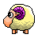](https://adrianotiger.github.io/desktopPet/Pets/esheep64/)  | gSheep Blue   [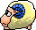](https://adrianotiger.github.io/desktopPet/Pets/blue_sheep/)  | gSheep Green   [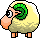](https://adrianotiger.github.io/desktopPet/Pets/green_sheep/) | gSheep Orange   [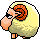](https://adrianotiger.github.io/desktopPet/Pets/orange_sheep/)  |
| gSheep Pink   [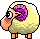](https://adrianotiger.github.io/desktopPet/Pets/pink_sheep/)  | gSheep Purple   [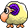](https://adrianotiger.github.io/desktopPet/Pets/purple_sheep/)  | gSheep Red   [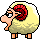](https://adrianotiger.github.io/desktopPet/Pets/red_sheep/) | gSheep Yellow   [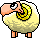](https://adrianotiger.github.io/desktopPet/Pets/yellow_sheep/)  |
|Bunny     | Asuna     | Neko    | Pingus   [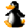](https://adrianotiger.github.io/desktopPet/Pets/pingus/)  |
|Ham Ham     | Fox   [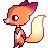](https://adrianotiger.github.io/desktopPet/Pets/fox/)  | Pikachu    | Zombie   [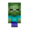](https://adrianotiger.github.io/desktopPet/Pets/zombie/)  |

[And many more...](https://adrianotiger.github.io/desktopPet/Pets/)

# Credits
## Libraries
This project used other Open Source projects:
- [github.com/naudio/NAudio](https://github.com/naudio/NAudio) - NAudio to play sounds

## Sprites - Thanks to
- [Oliver](https://github.com/OliverPets) - for the rainbow sheeps and the many sheep animations
- [RedSparr0w](https://github.com/RedSparr0w) - for the minecraft tools and spritesheet generator
- Michelle for the cats animations

## Coding - Thanks to
- [Sergi](https://github.com/Grunwaldt) - for the Tray Icon
- [Robin](https://github.com/rluiten) - implementing the [Graphviz tool](https://github.com/Adrianotiger/desktopPet/issues/6)
- [Zecheriah](https://github.com/ZechsVariety) - implementing [Tossing code](https://github.com/Adrianotiger/desktopPet/pull/150)
- [Xhonye](https://github.com/xhonye) - improving speed and implementing [Test scripts](https://github.com/Adrianotiger/desktopPet/pull/161)

# Want to help?

## Create your own mate/pet
You can download the Editor and create your own Mate! Please contibute, uploading your work to the Pet-Folder.  
What you need:
- 1 application icon (or a png that will be converted to an icon)
- 1 animation image: an image with transparency with all possible positions. (.png not too big... Something like 1000x500 px)

For more info about editing the xml file and add your own pet, follow the <a href='../../wiki/'>Wiki</a> page.

## Code
The code was documented with Natural Docs and is available in the doc-folder.

# License
Licensed under the **MIT License**. You are free to use, modify, and redistribute this software for personal or commercial purposes. Please retain attribution to the original DesktopPet project and its contributors in any redistributed version.
