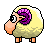

# Desktop Pet (eSheep)

Can you remember eSheep, the lovely desktop sheep?
 
If you had a lot of them on the desktop... welcome to this page! 
This project gives you the possibility to add a pet to your desktop.  

With a simple XML file (animations.xml) it is possible to change pet and animations.

# Application
This application is not a game, not an utility and not useful :P it simply shows you
a pet on the screen. This pet can fall down up to the taskbar and is able to detect 
windows on your desktop. 
In this way, this pet is able to walk, run, etc around your working screen area (also on multiscreens).

# Downloads

|        | Windows 7/8/10 | Windows 10 | Webpage | Tools |
|--------|----------------|------------|---------|-------|
| Type |  Portable exe | Store app | Javascript | Desktop applications |
| Description | Download rar, extract exe file and execute it. There is no installation. | Download it directly from the Microsoft store | Javascript file to implement it on your webpage | Some tools to edit and create your own pet.
| Link |  | <a href='https://www.microsoft.com/store/apps/9MX2V0TQT6RM'>Windows store</a> | <a href='https://github.com/Adrianotiger/web-esheep'>Open GitHub</a> project | -<a href='https://github.com/Adrianotiger/desktopPet/releases/tag/editor0.2'>Download Pet Editor</a> |

# Screen Mates included in this application
## eSheep
 
- esheep 64bit: Stray Sheep - the one delivered with the app 
- gsheep, a more powerful sheep and with much more animations (like the original one)
## Neko
 
Neko is another screen mate from 1995, ported to many systems.

# Credits
This project used other Open Source projects:
<ul>
<li><a href='https://github.com/naudio/NAudio'>NAudio</a> to play sounds
</ul>

# Thanks
<a href='https://github.com/Grunwaldt'>Sergi</a> for the Tray Icon 
<a href='https://github.com/rluiten'>Robin</a> improving the code and implementing the <a href='https://github.com/Adrianotiger/desktopPet/issues/6'>Graphviz tool</a>

# Want to create your own mate/pet?
I am working on an offline editor: <a href='https://github.com/Adrianotiger/desktopPet/releases/tag/editor0.2'>Download offline editor from GitHub</a>. 
What you need are:
<ul>
<li>1 application icon (.ico file)
<li>1 animation image: an image with transparency with all possible positions. (.png not too big... Something like 1000x500 px)
</ul> 
For more info about editing the xml file and add your own pet, follow the <a href='../../wiki/'>Wiki</a> page.  or download the manual to develop your pet online: <a href='https://github.com/Adrianotiger/desktopPet/raw/master/Manual/Manual%20-%20online%20editor.docx'>Manual-online editor.docx</a>

# Do you like the project?
If you like this project, you can donate 2-3$. 
I will use them to pay certificates or paying someone to create new sprites

